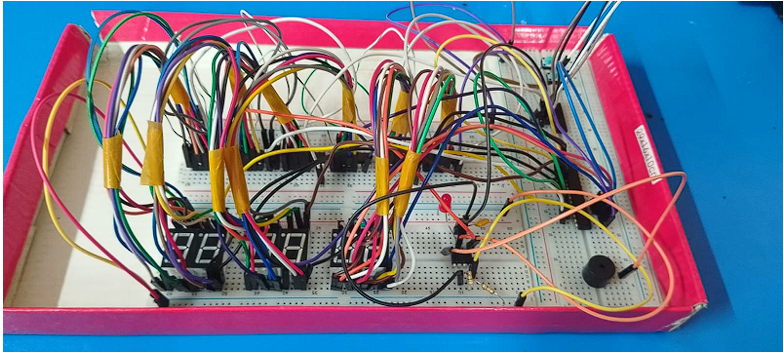
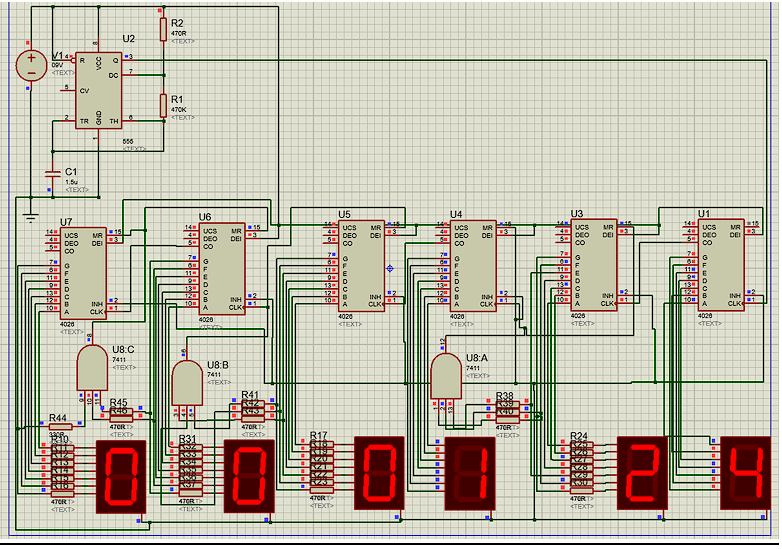

# Digital Clock Circuit — Electronics & Proteus

A digital clock circuit designed and simulated using hardware logic components and **Proteus 8 Professional**, without relying on a microcontroller or programming.

## Project Overview

The project implements a functional digital clock capable of displaying hours, minutes, and seconds on six 7-segment displays. The design uses **CD4026 counter ICs** to handle counting and display driving, together with logic gates for reset and rollover conditions.

The design also includes user-interaction and control features such as manual time setting, alarm activation, and time-zone adjustment.

## Features

- Digital display of **hours, minutes, and seconds**
- Cascaded **CD4026 counter ICs** for time counting
- Automatic rollover of:
  - Seconds after 59
  - Minutes after 59
  - Hours after 23
- Manual time adjustment using push-button switches
- Alarm setting and activation
- Buzzer output for alarm notification
- Time-zone adjustment using offset logic
- Optional calendar extension concept
- Circuit simulation and debugging in Proteus

## Main Components

| Component | Quantity | Purpose |
|---|---:|---|
| CD4026 Decade Counter IC | 6 | Counts digits and drives the 7-segment displays |
| 7-Segment Display | 6 | Displays hours, minutes, and seconds |
| IC 7408 / Logic Gates | Multiple | Implements reset and control conditions |
| 555 Timer IC | 1 | Generates the clock pulses |
| Push-Button Switches | 3 | Used for time and alarm setting |
| Buzzer | 1 | Provides the alarm output |
| Resistors & Capacitor | As required | Timing and current-limiting functions |

## Circuit Design

The six CD4026 ICs are arranged in cascaded stages:

- Two digits for **seconds**
- Two digits for **minutes**
- Two digits for **hours**

The carry output of each counter is connected to the next stage so that completed counting cycles increment the following digit.

Logic-gate circuits provide the required reset conditions for the clock:

- Seconds reset after reaching **59**
- Minutes reset after reaching **59**
- Hours reset after reaching **23**

## Timing

A **555 timer** is used as the clock pulse generator. Its output provides the pulses required to increment the first CD4026 counter, beginning the seconds-counting sequence.

## Time Setting

Push-button switches allow the user to manually adjust the clock by applying clock pulses to the relevant counter stages. Control logic is used to prevent interference with normal clock operation.

## Alarm Function

The design includes an alarm feature in which the current time is compared with a configured alarm time. When the times match, the alarm output activates the buzzer. A separate control allows the alarm to be enabled or disabled.

## Time-Zone Adjustment

The design includes time-zone adjustment using offset logic. A selectable offset can be applied to the hour value to simulate viewing the clock in another time zone.

## Simulation

The complete circuit was designed and tested in **Proteus 8 Professional**. Simulation was used to:

- Verify real-time counting
- Observe carry outputs and digit rollovers
- Test reset conditions
- Test manual time adjustment
- Test alarm behavior
- Debug the circuit before physical implementation

## Project Files

- `digital-clock.pdsprj` — Proteus project file
- `README.md` — Project documentation
- `simulation.png` — Circuit/simulation screenshot *(optional)*

## Learning Outcomes

This project provided practical experience with:

- Digital circuit design
- Counter ICs and cascading
- 7-segment display interfacing
- Logic-gate control and reset conditions
- Timing circuits using a 555 timer
- Circuit simulation and debugging in Proteus
- Designing modular electronic systems
- Integrating user inputs and alarm outputs

## Tools

**Proteus 8 Professional**

## Note

This project was developed as a team-based electronics project. The repository presents the technical design and implementation without listing individual team members or the original course/subject name.
